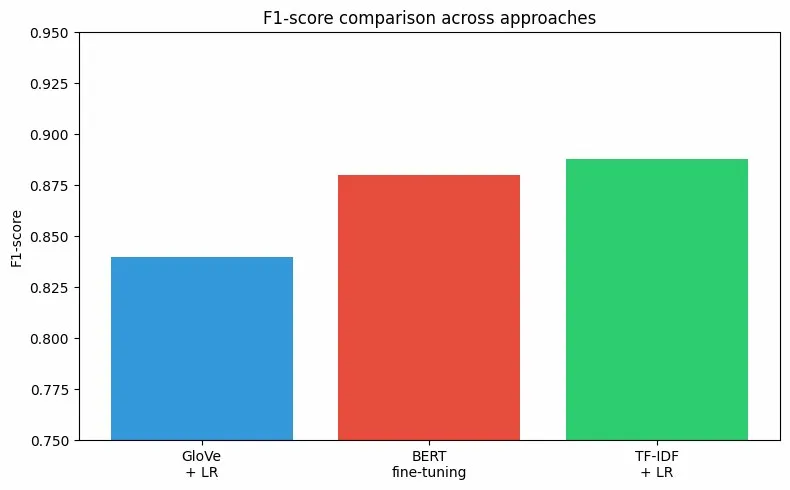

# BERT Sentiment Analysis

Fine-tuning **BERT** on 50,000 IMDB movie reviews for binary sentiment classification.  
Part of a series comparing classical NLP approaches vs. modern transformers.

---

## Results

| | Precision | Recall | F1 |
|---|---|---|---|
| Negative | 0.93 | 0.82 | 0.87 |
| Positive | 0.84 | 0.94 | 0.89 |
| **Overall** | | | **0.88** |

### Comparison across all three approaches



BERT scores similarly to TF-IDF (0.888) on this dataset — and that's an interesting result in itself. IMDB reviews tend to contain clear sentiment signals ("terrible", "excellent"), so even a simple word-frequency model handles it well. BERT's real advantage shows on harder tasks: sarcasm, short texts, or multi-class classification where context matters more.

---

## Dataset

[IMDB Movie Reviews — Kaggle](https://www.kaggle.com/datasets/lakshmi25npathi/imdb-dataset-of-50k-movie-reviews)

- 50,000 reviews
- 25,000 positive / 25,000 negative (perfectly balanced)
- Loaded directly via Hugging Face `datasets` library

---

## Approach

Pre-trained `bert-base-uncased` fine-tuned for sequence classification.  
No manual preprocessing — BERT's tokenizer handles everything, including HTML tags and negations like "not bad".

```
Raw review
   ↓ BERT tokenizer (subword tokenization, max_length=128)
   ↓ BertForSequenceClassification
   ↓ Fine-tuning: 2 epochs, lr=2e-5, batch_size=16
Positive / Negative
```

---

## Project Structure

```
bert-sentiment/
├── README.md
├── .gitignore
├── requirements.txt
├── bert_sentiment.py    ← full pipeline: data, training, evaluation
└── comparison.png       ← F1 comparison across 3 approaches
```

---

## How to Run

```bash
pip install -r requirements.txt
python bert_sentiment.py
```

> GPU strongly recommended. On CPU training will take several hours.  
> Google Colab with T4 GPU runs in ~20-30 minutes.

---

## Tech Stack

- Python 3.9
- PyTorch
- Hugging Face Transformers
- Hugging Face Datasets
- scikit-learn
- matplotlib
